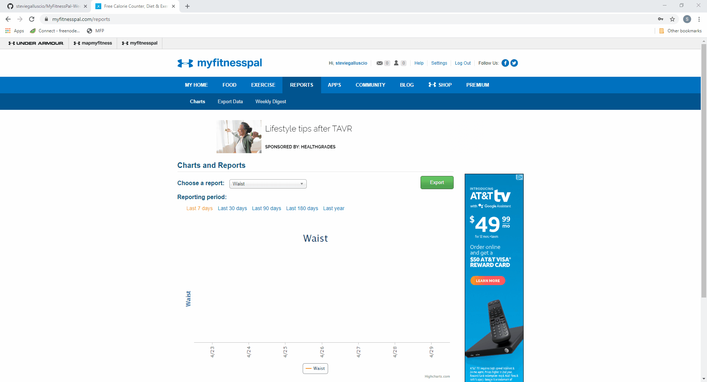

# MyFitnessPal Weekly Average :muscle:
A bookmarklet to display a table of data from MyFitnessPal reports and calculate weekly averages.
>  
## Features
  * Displays data from report graph in html table (Date, Amount)
  * Calculates average for every 7 days of data
  * As an html table it can be copied and pasted to excel/google sheet

## How to use
  1. Navigate to https://www.myfitnesspal.com/reports
  2. Choose report type
  3. Choose reporing peroid
  4. Click bookmarklet

Note: after changes to report type or peroid the bookmarklet must be clicked again to update table

## How to install
  Simply add a page to your bookmark bar with the name as whatever you wish and set the url as:

```javascript
javascript:(function(){if(document.getElementsByClassName('table0')[0]){document.getElementsByClassName('table0')[0].remove();}var t=document.getElementById('main').appendChild(document.createElement('table'));t.className='table0';var head=t.appendChild(document.createElement('thead')).appendChild(document.createElement('tr'));head.appendChild(document.createElement('td')).textContent='Date';head.appendChild(document.createElement('td')).textContent='Amount';head.appendChild(document.createElement('td')).textContent='Weekly Average';var body=t.appendChild(document.createElement('tbody'));var c,a;var l=MFP.Reports.chart.series[0].data.length;var i=l;var s=0;while(i--){s+=MFP.Reports.chart.series[0].data[i].y;c=body.appendChild(document.createElement('tr'));c.appendChild(document.createElement('td')).textContent=MFP.Reports.chart.series[0].data[i].category;c.appendChild(document.createElement('td')).textContent=MFP.Reports.chart.series[0].data[i].y;a=c.appendChild(document.createElement('td'));if((l-i)%7==0){a.textContent=(s/7).toFixed(2);a.style.backgroundColor='rgb(217, 217, 217)';s=0;}}})();
```
